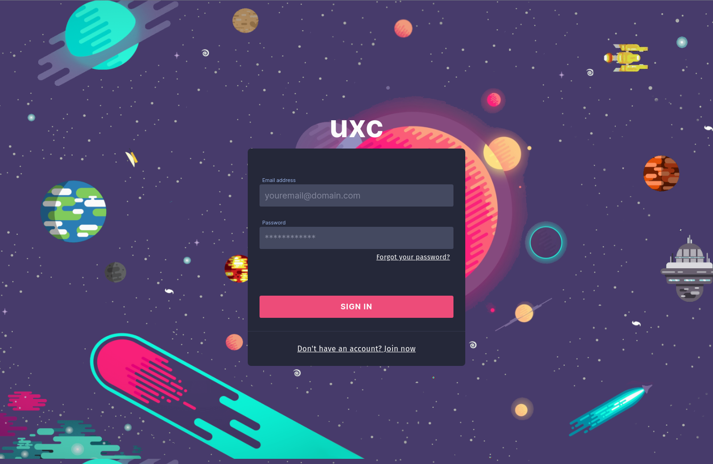
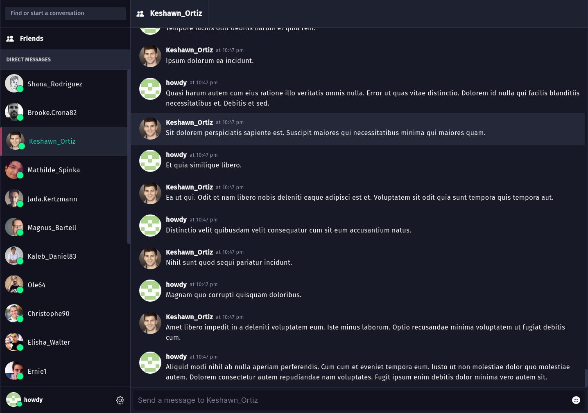

# uxc | realtime subscriptions

For this project, I wanted to design and implement a distributed, real-time chat application. I'm writing this README doc some time after having last worked on this project, so I don't fully recall at this moment what the architecture was. I'll return soon to re-familiarize myself and document it in detail.

I wrote this prior to becoming more steeped in systems design and distributed systems; there's many things I would do differently. For one, I would use GraphQL far more sparingly (just use simple websockets for the chat payloads instead of subscriptions). I would also not labor too much over the UI - I spent a lot of time here on bespoke components. I would not, however, change the focus on accessibility - this app is fully WCAG and ADA compliant, which is nice.

The architecture, generally, consists of a API layer using GraphQL subscriptions, Redis pub/sub, and Cookies for auth. The auth scheme is such that we wrap auth and refresh JWTs in a Cookie, then use those to manage sessions and user metadata. This was a strategy I picked up at a company I worked for a while back.

For the database layer, I used MongoDB with Mongoose. I remember using virtuals quite heavily, and other advanced Mongo strategies for performant document lookups. I just know I had spent a LOT of time researching how to optimize NoSQL for searching and real-time I/O. It's kind of a ridiculous use-case but that was the point.

The frontend is a React app running on Vite. I used Cypress for testing UX workflows and Jest for unit testing. The frontend runs behind an Nginx reverse proxy and load balancer. One of my favorite features here was a fully-featured search component I wrote - it uses a few different search algorithms to find a target and highlight inline results. There's also search by tag, user, text content, etc.

Finally, there's a common library (this entire project is a pnpm monorepo). Largely, this library stores common types and the graphql schema. I used graphql-codegen to write the schema in TypeScript and compile to gql.

I'll come back to this probably. It was a cool and feature-rich project.

## Features

- cookies auth and sticky sessions (context maintained across load-balanced instances)
- redis caching layer
- redis pubsub
- graphql + subscriptions
- realtime message events
- live message patching
- client-side caching
- client-side deduplication + data normalization

